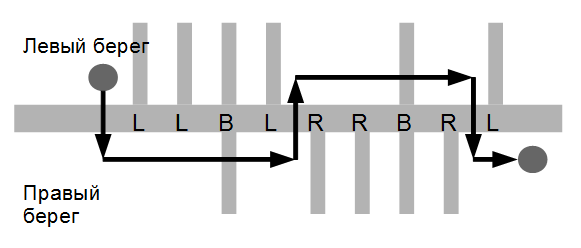

# Поход

https://coderun.yandex.ru/selections/algorithm-training-september-2025/problems/hike/description

## Описание задачи

Группа школьников решила сходить в поход вдоль Москвы-реки. У Москвы-реки существует множество притоков, которые могут
впадать в неё как с правого, так и с левого берега.

Школьники хотят начать поход в некоторой точке на левом берегу и закончить поход в некоторой точке на правом берегу,
возможно, переправляясь через реки несколько раз. Как известно, переправа как через реку, так и через приток
представляет собой определённую сложность, поэтому они хотят минимизировать число совершённых переправ. Переправляться
через реку и притоки можно только перпендикулярно их течению (т.е. нельзя переправиться через реку и приток «по
диагонали»).

Школьники заранее изучили карту и записали, в какой последовательности в Москву-реку впадают притоки на всём их
маршруте.

Помогите школьникам по данному описанию притоков определить минимальное количество переправ, которое им придётся
совершить во время похода.

## Формат ввода/вывода

| Параметр         | Описание                                                                                                                              |
|------------------|---------------------------------------------------------------------------------------------------------------------------------------|
| **Ввод**         | Единственная строка содержит описание Москвы-реки между начальной и конечной точкой похода. Длина строки не превосходит 200 символов. |
| **Символы**      | `L` — приток впадает с левого берега `R` — приток впадает с правого берега `B` — притоки впадают с обоих берегов                |
| **Начало/конец** | Поход начинается на левом берегу перед описанной частью реки и заканчивается на правом берегу после описанной части                   |
| **Вывод**        | Одно целое число — минимальное количество переправ                                                                                    |

## Ограничения

| Параметр            | Значение              |
|---------------------|-----------------------|
| Ограничение времени | 1 с                   |
| Ограничение памяти  | 256 МБ                |
| Длина строки        | не более 200 символов |

## Примеры

| Ввод        | Вывод |
|-------------|-------|
| `LLBLRRBRL` | `5`   |

# Решение

В каждую точку маршрута на левом берегу и на правом берегу можно попасть двумя способами:
- двигаясь прямо с 1 или 0 переходов (только через приток)
- двигаясь с противоположного берега с 2 или 1 переходом (через приток и Москва-реку)

В цикле пройдём по входной строке и посчитаем, сколько стоит добраться до каждой точки маршрута с учётом притоков.

Итоговая сложность: `O(n)`.
Итоговая память: `O(1)`.
